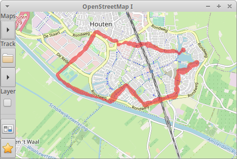
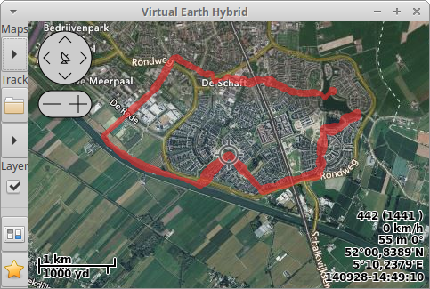

Welcome to project PaVi, an application to view GPS tracks on top of
map tiles, based on library OsmGpsMap, which can download, cache and
render map tiles from different web sources. As of now coding and
testing gets done with tracks recorded by MapFactor Navigator software
in `*.NMEA` and `*.GPX` file format.

The package is [hosted at GitHub](https://github.com/DTJF/pavi).
Find further information on this project at [the projects introduction
page](http://www.freebasic.net/forum/???).

Find detailed information on components at

- about [GTK](http://www.gtk.org)
- about [OsmGpsMap](http://github.com/nzjrs/osm-gps-map)
- about [FreeBASIC](http://www.freebasic.net), and
- about [MapFactorNavigator](https://navigatorfree.mapfactor.com/)

It's a GPLv3 licensed GtkApplication with grafical user interface,
command line control and DBus integration, designed to:

* show a worlds map segment (tiles downloaded/chached from different web sources)
* move in segment (keyboard/mouse: north, east, south, west, zoom in or out)
* load recorded track\[s\] (`*.NMEA` or `*.GPX` file format)
* plot track on map (custom color/width for lines and points)
* decorate points (scaled and/or colored by elevation, speed or direction)
* walk in track (map centered at the current track point)
* show point data

The following screen shot shows a track ploted (by cairo) on top of OSM
(Open Stree Map) map tiles by red points (60 % translucent) with
variable diameter (scaled by the points elevation):

The second screen shot plots the same track on top of Virtual Earth
Hybrid map tiles, complemented by a layer providing controls and point
info:

Currently this project is work in progress in an early stage. Planed
future improvements are:

* advanced controls (keyboard and popup menues)
* further command line options
* replace dummy parameter dialog, save/load parameters
* additional custom map sources
* remember custom views (save/load: map segment, track point at map zoom)
* more track customizations
* track diagram[s] (ie. elevation vs. time, speed vs. point#)
* search in track (time, position, point distance, elevation jumps, ...)
* further track file formats?
* finalise documentation
* tiles download for off-line use

License
=======

GPLv3: Copyright (C) 2021, Thomas{ doT ]Freiherr[ At ]gmx[ DoT }net

This bundle is free software; you can redistribute the sources and/or
modify them under the terms of the GNU General Public License version 3
as published by the Free Software Foundation.

The programs are distributed in the hope that they will be useful, but
WITHOUT ANY WARRANTY; without even the implied warranty of
MERCHANTABILITY or FITNESS FOR A PARTICULAR PURPOSE. See the GNU
General Public License for more details.

You should have received a copy of the GNU General Public License along
with this program; if not, write to the Free Software Foundation, Inc.,
51 Franklin Street, Fifth Floor, Boston, MA 02110- 1301, USA. Or refer
to http://www.gnu.org/licenses/gpl-3.0.html
